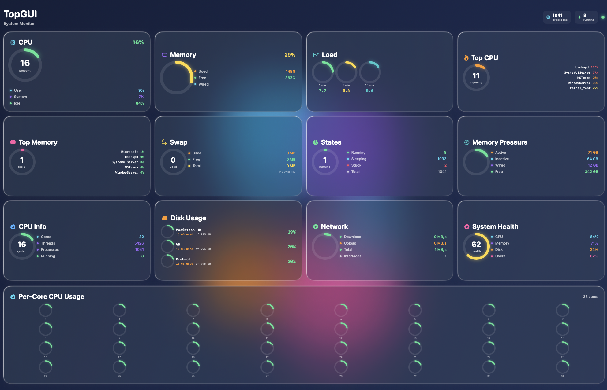

# TopGUI

**A visually stunning, modern glassmorphic system monitor for macOS with AI-powered insights**


TopGUI provides comprehensive real-time system monitoring with a **CleanMyMac-inspired dark blue theme** featuring a 4-column grid layout, 12 stat cards, 50+ smooth circular dial gauges, floating animated blobs, and extreme glassmorphic design. **Now enhanced with AI-powered performance insights!**



## Features

### 🤖 AI Performance Insights (NEW in v3.8.0)

TopGUI now includes **4 AI-powered features** for intelligent system analysis:

#### 1. AI Performance Insights 💡
- Natural language explanations of system performance
- "Your Mac is slow because Safari is using 8.2GB RAM across 47 tabs..."
- Identifies root causes, not just symptoms
- Specific process and metric references

#### 2. AI Anomaly Detection 🚨
- Detects unusual patterns compared to baseline
- Early warning for memory leaks, CPU spikes, runaway processes
- Severity levels: Low, Medium, High, Critical
- Likely cause identification

#### 3. AI Optimization Advice 🎯
- 3-5 specific, actionable recommendations
- Prioritized by impact and difficulty
- Explains WHY each optimization helps
- Example: "Close unused Safari tabs to free 8GB RAM (Impact: High, Difficulty: Easy)"

#### 4. AI Q&A Interface 💬
- Ask questions in natural language
- "Why is my Mac slow?" "Should I upgrade RAM?" "What's using all my CPU?"
- Context-aware answers from actual system metrics
- Interactive troubleshooting

#### AI Backend Support
Choose from 3 AI backends:
- **Ollama** - Fast GPU-accelerated (localhost:11434)
- **TinyLLM** by Jason Cox - Lightweight Docker (localhost:8000)
- **MLX Toolkit** - Python-based Apple Silicon optimization

**Setup:** See AI_FEATURES_PLAN.md for complete documentation

**Third-Party:** TinyLLM by Jason Cox (https://github.com/jasonacox/TinyLLM)

**Privacy:** All AI processing is 100% local - no data leaves your machine

---

## Features

### 🎨 CleanMyMac-Inspired Design
- **Dark Navy Blue Theme**: Professional dark background (rgb 0.08-0.12, 0.12-0.18, 0.22-0.32)
- **4-Column Grid Layout**: 12 stat cards in responsive LazyVGrid
- **50+ Smooth Circular Dial Gauges**: All gauges animate smoothly with 0.6s easeInOut transitions
- **Floating Animated Blobs**: 5 massive colorful circles (cyan, purple, pink, orange) that gently float
- **Ultra-Translucent Glass Cards**: 25% white opacity with .ultraThinMaterial blur
- **Thick White Borders**: 2px borders for strong definition on dark background
- **Dual Shadows**: Black shadow + white highlight for true 3D depth
- **Vibrant Accent Colors**: Cyan, purple, hot pink, orange, yellow, mint green
- **White Text**: High contrast for excellent readability on dark background
- **Heat Map Visualizations**: Green → yellow → orange → red
- **Modern Rounded Typography**: 32px headers with rounded San Francisco font
- **Clickable Cards**: Tap any card for detailed view

### 📊 Comprehensive System Monitoring (12 Stat Cards)

**4-Column Grid Layout:**

**Row 1:**
1. **CPU Usage**: Large circular gauge with user/system/idle breakdown
2. **Memory**: Circular gauge showing memory usage with breakdown
3. **Load Averages**: Three 65px dials for 1min, 5min, 15min
4. **Top CPU**: Shows % of total CPU capacity used by top 5 processes

**Row 2:**
5. **Top Memory**: Shows % of total memory used by top 5 processes
6. **Swap**: Swap usage with dial showing used vs free
7. **Process States**: Running vs sleeping with breakdown
8. **Memory Pressure**: Detailed vm_stat memory pressure analysis

**Row 3:**
9. **CPU Info**: System-wide CPU usage with cores/threads/processes stats
10. **Disk Usage**: Per-disk space gauges (main volumes only, updates every 5 min)
11. **Network**: Combined bandwidth with download/upload/total
12. **System Health**: Overall health score based on CPU/Memory/Disk

**Full Width:**
- **Per-Core CPU**: 32 cores displayed in 8×4 grid with individual gauges

**Menu Bar:**
- **Actions Menu**: Kill High CPU (⌘K), Refresh (⌘R), Export (⌘E)

**All Features:**
- **Smooth Animations**: All 50+ gauges animate with 0.6s easeInOut transitions
- **Clickable Cards**: Tap any card for detailed view with expanded metrics
- **Heat-Mapped Values**: Color-coded indicators throughout (green → yellow → orange → red)
- **Real-Time Updates**: CPU, memory, network update every second; disk every 5 minutes

### ⚙️ Process Management
- **Detailed Views**: Click any process for comprehensive statistics
- **Kill Process**: Terminate processes with confirmation
- **Change Priority**: Adjust process nice values (-20 to +20)
- **Process Stats**: View threads, ports, memory regions, and more

## Screenshots

**Dashboard View** - 4-column grid with 12 glassmorphic cards, each with smooth circular dial gauges:


**Features Visible:**
- 12 stat cards in 4×3 grid layout
- 50+ smooth animated circular gauges
- Dark navy blue background with floating colorful blobs
- Per-core CPU visualization (32 cores in 8×4 grid)
- Real-time system monitoring with heat-mapped colors
- Glassmorphic frosted glass cards with soft shadows
- All cards clickable for detailed views

## Installation

### From DMG (Recommended)
1. Download `TopGUI-v3.7.0-build12.dmg` from releases
2. Mount the DMG and drag TopGUI.app to Applications
3. Launch TopGUI from Applications folder

### From Source
```bash
git clone https://github.com/kochj23/TopGUI.git
cd TopGUI
xcodegen generate
open TopGUI.xcodeproj
```

Build with Xcode 15+ and run on macOS 13.0+

## Requirements

- macOS 13.0 (Ventura) or later
- Apple Silicon or Intel processor
- Permission to execute system commands (top, kill, renice)

## How It Works

TopGUI parses output from the native macOS `top` command to gather real-time system statistics. The data is presented in a modern SwiftUI interface with glassmorphic design elements.

### Architecture
- **TopDataManager**: Executes `top` command and parses output
- **ContentView**: Main dashboard with glassmorphic cards and gradient background
- **ProcessDetailView**: Modal detail view with modern controls
- **ModernDesign**: Glassmorphic design system with purple gradients and frosted glass

## Security & Permissions

TopGUI requires the following entitlements:
- **No Sandbox**: Allows execution of system commands (top, kill, renice)
- **JIT & Unsigned Memory**: For dynamic code execution
- **Disable Library Validation**: For system tool integration

Some operations (kill, renice) may require administrator privileges for processes owned by other users.

## Development

### Project Structure
```
TopGUI/
├── TopGUI/
│   ├── TopGUIApp.swift          # App entry point
│   ├── ContentView.swift         # Main glassmorphic dashboard
│   ├── ProcessDetailView.swift   # Process detail modal
│   ├── TopDataManager.swift      # Data parsing and process control
│   ├── ProcessInfo.swift         # Data models
│   ├── ModernDesign.swift        # Glassmorphic design system
│   ├── Info.plist               # App configuration
│   └── TopGUI.entitlements      # Security entitlements
├── project.yml                   # Xcodegen configuration
└── README.md
```

### Building
```bash
# Generate Xcode project
xcodegen generate

# Build debug version
xcodebuild -project TopGUI.xcodeproj -scheme TopGUI -configuration Debug build

# Build release version
xcodebuild -project TopGUI.xcodeproj -scheme TopGUI -configuration Release build
```

### Testing
Launch the app and verify:
- [ ] CPU/memory stats update in real-time
- [ ] Process list sorts correctly
- [ ] Search filters process list
- [ ] Process detail view opens on click
- [ ] Kill process works with confirmation
- [ ] Priority adjustment applies successfully

## Roadmap

Future enhancements:
- [ ] GPU usage monitoring
- [ ] Network and disk I/O statistics
- [ ] Historical graphs and trends
- [ ] Export data (CSV, JSON)
- [ ] Process grouping and filtering presets
- [ ] Custom color themes
- [ ] Process activity alerts and notifications

## Credits

**Created by Jordan Koch**

Design inspired by modern glassmorphism trends, macOS Ventura aesthetics, and contemporary monitoring dashboards. Built with SwiftUI and love for beautiful interfaces.

**Version History:**
- v3.7.0: Fixed Top CPU capacity dial, improved CPU Info card, smooth animations, stable disk updates
- v3.6.0: 4-column layout with System Health card, integers for readability
- v3.5.0: Moved Quick Actions to menu bar, 4-column grid
- v3.2.0: Interactive clickable cards with detailed views
- v3.0.0: Major release with 50+ circular dial gauges
- v2.2.0: CleanMyMac-inspired grid layout with 9 stat cards
- v2.1.0: Extreme glassmorphism with floating colorful blobs
- v2.0.0: Modern glassmorphic redesign with purple gradients
- v1.0.0: Original LCARS Star Trek TNG-inspired design

## License

MIT License

Copyright (c) 2026 Jordan Koch

Permission is hereby granted, free of charge, to any person obtaining a copy
of this software and associated documentation files (the "Software"), to deal
in the Software without restriction, including without limitation the rights
to use, copy, modify, merge, publish, distribute, sublicense, and/or sell
copies of the Software, and to permit persons to whom the Software is
furnished to do so, subject to the following conditions:

The above copyright notice and this permission notice shall be included in all
copies or substantial portions of the Software.

THE SOFTWARE IS PROVIDED "AS IS", WITHOUT WARRANTY OF ANY KIND, EXPRESS OR
IMPLIED, INCLUDING BUT NOT LIMITED TO THE WARRANTIES OF MERCHANTABILITY,
FITNESS FOR A PARTICULAR PURPOSE AND NONINFRINGEMENT. IN NO EVENT SHALL THE
AUTHORS OR COPYRIGHT HOLDERS BE LIABLE FOR ANY CLAIM, DAMAGES OR OTHER
LIABILITY, WHETHER IN AN ACTION OF CONTRACT, TORT OR OTHERWISE, ARISING FROM,
OUT OF OR IN CONNECTION WITH THE SOFTWARE OR THE USE OR OTHER DEALINGS IN THE
SOFTWARE.

## Support

For issues, feature requests, or contributions, please open an issue on GitHub.

---

**Build Information:**
- Version: 3.7.0
- Build: 12
- Build Date: January 15, 2026
- Design: CleanMyMac-Inspired Dark Blue with 4-Column Grid
- Cards: 12 stat cards with 50+ smooth animated dial gauges
- Layout: 4-column grid + full-width per-core CPU
- Minimum macOS: 13.0
- Architecture: Universal (Apple Silicon & Intel)
- Distribution: Direct download (GitHub), Homebrew, or SetApp

---

**Last Updated:** January 22, 2026
**Status:** ✅ Production Ready
