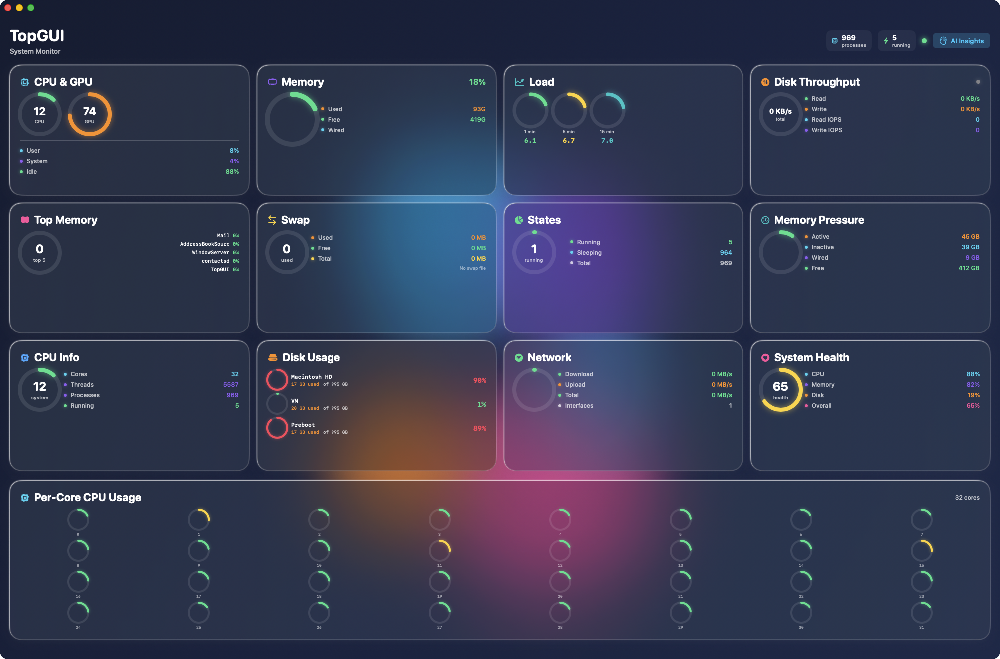

# TopGUI


**A modern, glassmorphic system monitor for macOS with AI-powered insights, 13 interactive dashboard cards, a WidgetKit desktop widget, and local API integration.**

Written by Jordan Koch ([@kochj23](https://github.com/kochj23))

---



---

## Table of Contents

- [Overview](#overview)
- [Architecture](#architecture)
- [Features](#features)
- [Installation](#installation)
- [Keyboard Shortcuts](#keyboard-shortcuts)
- [AI Integration](#ai-integration)
- [Widget](#widget)
- [Local API Server](#local-api-server)
- [Requirements](#requirements)
- [Building from Source](#building-from-source)
- [Version History](#version-history)
- [License](#license)

---

## Overview

TopGUI replaces Activity Monitor with a purpose-built, visually rich dashboard. It parses live output from `top`, `vm_stat`, `sysctl`, `iostat`, and `netstat` to present CPU, memory, disk, GPU, network, and process data in a 4-column grid of clickable glass cards. Each card expands into a detail sheet with breakdowns, sparkline histories, and per-component stats.

An optional AI layer connects to 9 backends (5 cloud, 4 local) to analyze system telemetry, detect anomalies, recommend optimizations, and answer natural-language questions about your machine.

A WidgetKit extension surfaces key metrics on the macOS desktop in three sizes, synced from the main app every 10 seconds via App Group shared storage.

---

## Architecture

```
+------------------------------------------------------------------+
|                        TopGUI.app (SwiftUI)                      |
|                                                                  |
|  TopGUIApp.swift                                                 |
|    |                                                             |
|    +-- ContentView.swift                                         |
|    |     4-column LazyVGrid of 13 interactive glass cards        |
|    |     GlassmorphicBackground (floating animated blobs)        |
|    |     Process search, sort, detail sheets                     |
|    |                                                             |
|    +-- TopDataManager.swift                                      |
|    |     1-second Timer driving:                                 |
|    |       fetchTopData()       -- top -l 1 (CPU, procs, mem)   |
|    |       fetchPerCoreCPU()    -- sysctl hw.ncpu + parsing      |
|    |       fetchVMStat()        -- vm_stat (page stats)          |
|    |       fetchNetworkStats()  -- netstat (per-interface)       |
|    |       fetchSwapUsage()     -- sysctl vm.swapusage           |
|    |       fetchGPUUsage()      -- Metal perf counters           |
|    |       fetchIOStat()        -- df (every 5 min)              |
|    |     syncToWidget()  every 10s via SharedDataManager          |
|    |                                                             |
|    +-- DiskThroughputService.swift                               |
|    |     2-second Timer: read/write MB/s, IOPS, session totals   |
|    |     30-sample history ring buffer for sparklines            |
|    |                                                             |
|    +-- NovaAPIServer.swift                                       |
|    |     NWListener on 127.0.0.1:37443 (loopback only)          |
|    |     REST endpoints: /api/status, /api/ping, /api/system     |
|    |                                                             |
|    +-- AIBackendManager.swift + Enhanced + Generation            |
|    |     Detects 9 backends, manages keys via Keychain           |
|    |     Auto-fallback chain across providers                    |
|    |                                                             |
|    +-- AIInsightsView.swift                                      |
|    |     4-tab AI interface: Insights | Anomalies | Optimize | QA|
|    |                                                             |
|    +-- EthicalAIGuardian.swift                                   |
|    |     Content policy enforcement, violation logging            |
|    |                                                             |
|    +-- AICapabilities/                                           |
|          AnalysisUnified   -- system telemetry analysis          |
|          ImageGenerationUnified -- ComfyUI / SwarmUI / A1111    |
|          VoiceUnified      -- speech-to-text, text-to-speech    |
|          SecurityUnified   -- threat pattern detection           |
|                                                                  |
+---------------------------+--------------------------------------+
                            |
              App Group: group.com.jkoch.topgui
              UserDefaults + JSON file (redundant)
                            |
+---------------------------+--------------------------------------+
|                    TopGUI Widget (WidgetKit)                      |
|                                                                  |
|  TopGUIWidget.swift                                              |
|    Small  -- CPU %, Memory %, Health score                       |
|    Medium -- Gauges, top process, health status                  |
|    Large  -- All gauges, details, process count                  |
|                                                                  |
|  SharedDataManager.swift  -- reads from App Group                |
|  WidgetData.swift         -- WidgetSystemStats, HealthStatus     |
+------------------------------------------------------------------+

+------------------------------------------------------------------+
|                     Shared/ (both targets)                        |
|  WidgetData.swift         -- Codable data models                 |
|  SharedDataManager.swift  -- App Group read/write                |
+------------------------------------------------------------------+
```

---

## Features

### Dashboard Cards (13 Interactive Panels)

Every card is clickable. Tapping opens a detail sheet with expanded metrics.

| Card | Metrics | Detail View |
|------|---------|-------------|
| CPU and GPU | Real-time dual circular gauges | User / System / Idle breakdown, GPU utilization |
| Memory | Physical memory gauge with percentage | Used / Free / Wired / Compressed breakdown |
| Load Averages | 1 / 5 / 15 minute load with per-core scaling | Historical trends, load-per-core ratios |
| Disk Throughput | Live read/write MB/s with activity indicator | IOPS, session totals, sparkline history |
| Top Memory | Top 5 memory consumers with combined gauge | Full top-10 list with percentages |
| Swap Usage | Virtual memory paging with used/free/total | Swapins / Swapouts, swap file status |
| Process States | Running / Sleeping / Stuck distribution | Full state breakdown, thread counts |
| Memory Pressure | Active / Inactive / Wired / Free pages | Page faults, COW, compressions, pageins/pageouts |
| CPU Info | Core count, thread count, system utilization | Architecture details, process counts |
| Disk Usage | Per-volume capacity bars | Mount points, filesystem types, GB used/total |
| Network | Download / Upload bandwidth gauges | Per-interface stats, packet counts |
| System Health | Composite health score (0-100%) | CPU / Memory / Disk sub-scores with weights |
| Per-Core CPU | Full-width grid of all cores | Individual core heat-mapped mini-gauges |

### Visual Design

- **Glassmorphic UI** -- Dark navy background with floating, animated color blobs and gaussian blur
- **Heat-mapped colors** -- Green to yellow to orange to red, scaling with load
- **Spring-animated gauges** -- Circular dials with glow shadows that respond to real-time data
- **Hidden title bar** -- Full-bleed dashboard window with custom header
- **4-column responsive grid** -- Cards scale to window width

### AI-Powered Insights (4 Modes)

- **Insights** -- AI analyzes current CPU, memory, and disk telemetry and summarizes what is happening
- **Anomaly Detection** -- Flags unusual patterns (sudden spikes, runaway processes, memory pressure)
- **Optimization** -- Recommends actions to reduce load or reclaim resources
- **Q&A** -- Natural language questions about your system ("Why is my CPU at 90%?")

### Ethical AI Safeguards

All AI interactions pass through the EthicalAIGuardian, which enforces content policies, detects prohibited use patterns, blocks harmful content, and logs violations with hashed identifiers. This component cannot be disabled.

---

## Installation

TopGUI is distributed as a DMG installer. It is not available on the Mac App Store.

### From DMG (Recommended)

1. Download the latest `.dmg` from the [Releases](https://github.com/kochj23/TopGUI/releases) page.
2. Open the DMG and drag **TopGUI.app** to your Applications folder.
3. Launch from Applications or Spotlight.

### From Source

```bash
cd /Volumes/Data/xcode/TopGUI
xcodebuild -scheme TopGUI -configuration Release build

# Copy to Applications
cp -R ~/Library/Developer/Xcode/DerivedData/TopGUI-*/Build/Products/Release/TopGUI.app /Applications/

open /Applications/TopGUI.app
```

### Sandbox Policy

TopGUI runs without App Sandbox (`com.apple.security.app-sandbox = false`). This is required for unrestricted access to system commands (`top`, `vm_stat`, `sysctl`, `iostat`, `netstat`, `df`) and the ability to kill processes.

---

## Keyboard Shortcuts

| Shortcut | Action |
|----------|--------|
| Cmd+K | Kill highest-CPU process |
| Cmd+R | Refresh all stats |
| Cmd+I | Open AI Insights panel |
| Cmd+Shift+B | AI Backend Settings |
| Cmd+E | Export data (reserved) |

---

## AI Integration

TopGUI supports 9 AI backends. Configure the active backend from the AI menu.

### Cloud Providers

| Provider | Service | Use Case |
|----------|---------|----------|
| OpenAI | GPT-4o | Advanced system analysis and Q&A |
| Google Cloud | Vertex AI | Telemetry analysis, vision, speech |
| Microsoft Azure | Cognitive Services | System diagnostics |
| AWS | Bedrock | Large-scale analysis |
| IBM Watson | NLU, Discovery | Natural language understanding |

### Local Backends (Free, Private)

| Backend | Port | Notes |
|---------|------|-------|
| Ollama | 11434 | Default backend; `ollama pull mistral:latest` to get started |
| MLX | 5050 | Apple Silicon optimized inference |
| TinyChat | 8000 | Lightweight local LLM |
| OpenWebUI | 8080 | Self-hosted web UI with RAG |

### Image Generation (Available via AI Capabilities)

| Backend | Port |
|---------|------|
| ComfyUI | 8188 |
| Automatic1111 | 7860 |
| SwarmUI | 7801 |

The backend manager auto-detects which services are running and provides fallback ordering. API keys are stored in the macOS Keychain.

### Quick Start with Ollama

```bash
brew install ollama
ollama serve
ollama pull mistral:latest
```

Launch TopGUI, press Cmd+I, and the AI Insights panel will connect automatically.

---

## Widget

TopGUI includes a WidgetKit extension that displays system stats on your macOS desktop.

### Available Sizes

| Size | Content |
|------|---------|
| Small | CPU usage, Memory usage, Health score |
| Medium | CPU and Memory gauges, top process, health status |
| Large | All gauges (CPU, Memory, GPU, Health), details, process count |

### How It Works

1. The main app writes a `WidgetSystemStats` snapshot to the App Group (`group.com.jkoch.topgui`) every 10 seconds.
2. Data is stored in both UserDefaults and a JSON file for redundancy.
3. The widget reads from the App Group and refreshes its timeline every 5 minutes.
4. Colors are heat-mapped to match the main app's visual language.

### Adding the Widget

1. Right-click the desktop and select "Edit Widgets".
2. Search for "TopGUI".
3. Choose Small, Medium, or Large.
4. Drag to your desktop.

Requires macOS 14 Sonoma or later.

---

## Local API Server

TopGUI exposes a lightweight HTTP API on port **37443**, bound to `127.0.0.1` only (no external network exposure). This allows integration with Nova (OpenClaw AI) and other local automation tools.

### Endpoints

```
GET  /api/status     -- App status, version, uptime
GET  /api/ping       -- Health check (returns {"pong": "true"})
GET  /api/system     -- Live system stats summary
GET  /api/processes  -- Cached process list
```

### Example

```bash
curl -s http://127.0.0.1:37443/api/status | python3 -m json.tool
```

The API server starts automatically with the app and requires no authentication (loopback only).

---

## Requirements

| Requirement | Minimum |
|-------------|---------|
| macOS | 13.0 Ventura (14.0 Sonoma for widget) |
| Architecture | Apple Silicon or Intel |
| Disk space | ~100 MB |
| Internet | Optional (for cloud AI only) |
| Xcode | 15.0+ (to build from source) |

---

## Building from Source

```bash
git clone git@github.com:kochj23/TopGUI.git
cd TopGUI
xcodebuild -scheme TopGUI -configuration Release build
```

The project uses no external dependencies. All frameworks are Apple-provided:

- SwiftUI
- WidgetKit
- Combine
- Foundation
- Network (NWListener for API server)
- CoreGraphics
- CryptoKit (EthicalAIGuardian hashing)
- AVFoundation (voice capabilities)
- Natural Language

---

## Project Structure

```
TopGUI/
|-- TopGUI/                          Main app target
|   |-- TopGUIApp.swift              App entry point, menu commands
|   |-- ContentView.swift            Dashboard grid, 13 card views
|   |-- TopDataManager.swift         System data collection engine
|   |-- DiskThroughputService.swift  Disk I/O monitoring service
|   |-- NovaAPIServer.swift          Local HTTP API (port 37443)
|   |-- ModernDesign.swift           Glassmorphic theme, colors, components
|   |-- CardDetailView.swift         Expanded detail sheets per card
|   |-- ProcessDetailView.swift      Per-process detail view
|   |-- AIInsightsView.swift         AI insights 4-tab interface
|   |-- ProcessInfo.swift            Data models (ProcessInfo, SystemStats, DiskStats, NetworkInterface)
|   |-- NotificationNames.swift      Notification constants
|   |-- AICapabilities/
|   |   |-- UnifiedAICapabilities.swift
|   |   |-- AnalysisUnified.swift
|   |   |-- ImageGenerationUnified.swift
|   |   |-- VoiceUnified.swift
|   |   +-- SecurityUnified.swift
|   |-- Assets.xcassets/
|   |-- Info.plist
|   +-- TopGUI.entitlements
|
|-- TopGUI Widget/                   WidgetKit extension
|   |-- TopGUIWidget.swift           Widget views (Small/Medium/Large)
|   |-- WidgetData.swift             Widget data models
|   |-- SharedDataManager.swift      App Group reader
|   |-- Info.plist
|   +-- TopGUI_Widget.entitlements
|
|-- Shared/                          Code shared between both targets
|   |-- WidgetData.swift             WidgetSystemStats, HealthStatus
|   +-- SharedDataManager.swift      App Group read/write manager
|
|-- AIBackendManager.swift           AI backend detection and management
|-- AIBackendManager+Enhanced.swift  Connection testing, metrics
|-- AIBackendManager+Generation.swift  AI text generation routing
|-- AIBackendStatusMenu.swift        Menu bar AI status indicator
|-- AISystemAnalyzer.swift           System telemetry AI analysis
|-- EthicalAIGuardian.swift          Content policy enforcement
|-- AIBackendManager+EthicalGuardian.swift
|
|-- Screenshots/
|-- LICENSE                          MIT License
|-- SECURITY.md
|-- ETHICAL_AI_TERMS_OF_SERVICE.md
+-- TopGUI.xcodeproj/
```

---

## Version History

### v3.8.0 (February 4, 2026)
- Added WidgetKit widget with Small, Medium, and Large sizes
- App Group data sharing with 10-second sync interval
- Widget displays CPU, Memory, GPU, Health, and top process
- Matching dark glassmorphic design on widget

### v3.7.0 (February 2, 2026)
- Added Disk Throughput card with real-time read/write speeds and IOPS
- All 13 cards now clickable with detail views
- Added DiskThroughputService with sparkline history

### v3.6.0 (January 26, 2026)
- Added 5 cloud AI providers (OpenAI, Google Cloud, Azure, AWS, IBM Watson)
- Added EthicalAIGuardian content policy enforcement
- Unified AI capabilities module (analysis, image gen, voice, security)
- Auto-fallback system for AI backends

### v3.5.0 (January 2026)
- Initial public release
- 12 monitoring cards with glassmorphic design
- Local AI insights (Ollama, MLX, TinyChat, OpenWebUI)
- Process management (search, sort, kill)

---

## License

MIT License -- see [LICENSE](./LICENSE).

```
Copyright (c) 2026 Jordan Koch

Permission is hereby granted, free of charge, to any person obtaining a copy
of this software and associated documentation files (the "Software"), to deal
in the Software without restriction, including without limitation the rights
to use, copy, modify, merge, publish, distribute, sublicense, and/or sell
copies of the Software, and to permit persons to whom the Software is
furnished to do so, subject to the following conditions:

The above copyright notice and this permission notice shall be included in all
copies or substantial portions of the Software.

THE SOFTWARE IS PROVIDED "AS IS", WITHOUT WARRANTY OF ANY KIND, EXPRESS OR
IMPLIED, INCLUDING BUT NOT LIMITED TO THE WARRANTIES OF MERCHANTABILITY,
FITNESS FOR A PARTICULAR PURPOSE AND NONINFRINGEMENT.
```

---

## More Apps by Jordan Koch

| App | Description |
|-----|-------------|
| [NMAPScanner](https://github.com/kochj23/NMAPScanner) | Network security scanner with AI threat detection |
| [RsyncGUI](https://github.com/kochj23/RsyncGUI) | Native macOS GUI for rsync file synchronization |
| [ExcelExplorer](https://github.com/kochj23/ExcelExplorer) | Native macOS Excel/CSV file viewer |
| [DotSync](https://github.com/kochj23/DotSync) | Configuration file synchronization across machines |
| [icon-creator](https://github.com/kochj23/icon-creator) | App icon set generator for all Apple platforms |

[View all projects](https://github.com/kochj23?tab=repositories)

---

Written by Jordan Koch. Copyright 2026. All rights reserved.

> Disclaimer: This is a personal project created on my own time. It is not affiliated with, endorsed by, or representative of my employer.
