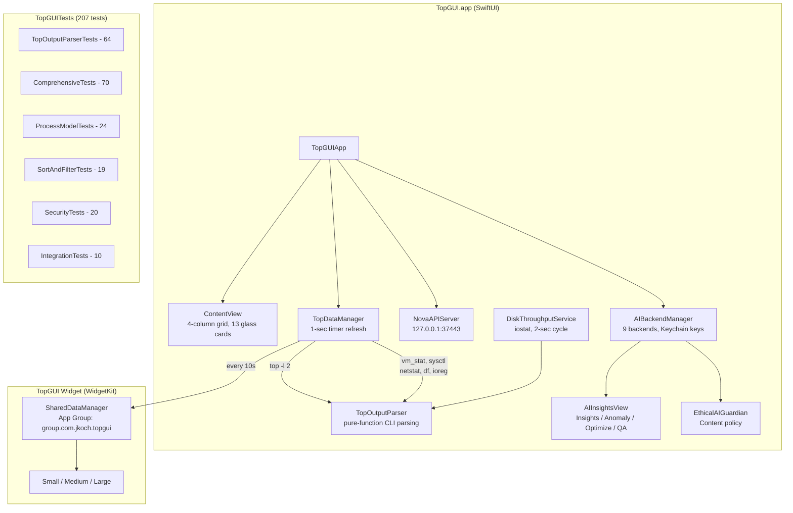

# TopGUI


**A glassmorphic system monitor for macOS with 13 interactive dashboard cards, AI-powered insights, WidgetKit extension, and local API integration.**

Written by Jordan Koch ([@kochj23](https://github.com/kochj23)).

---

## Architecture



---

## Features

### Dashboard Cards (13 Interactive Panels)

Every card is clickable and opens a detail sheet with expanded metrics.

| Card | Metrics | Detail View |
|---|---|---|
| CPU and GPU | Real-time dual circular gauges | User / System / Idle breakdown, GPU utilization |
| Memory | Physical memory gauge with percentage | Used / Free / Wired / Compressed breakdown |
| Load Averages | 1 / 5 / 15 minute load with per-core scaling | Historical trends, load-per-core ratios |
| Disk Throughput | Live read/write MB/s with activity indicator | IOPS, session totals, sparkline history |
| Top Memory | Top 5 memory consumers with combined gauge | Full top-10 list with percentages |
| Swap Usage | Virtual memory paging with used/free/total | Swapins / Swapouts, swap file status |
| Process States | Running / Sleeping / Stuck distribution | Full state breakdown, thread counts |
| Memory Pressure | Active / Inactive / Wired / Free pages | Page faults, COW, compressions, pageins/pageouts |
| CPU Info | Core count, thread count, system utilization | Architecture details, process counts |
| Disk Usage | Per-volume capacity bars | Mount points, filesystem types, GB used/total |
| Network | Download / Upload bandwidth gauges | Per-interface stats, packet counts |
| System Health | Composite health score (0-100%) | CPU / Memory / Disk sub-scores with weights |
| Per-Core CPU | Full-width grid of all cores | Individual core heat-mapped mini-gauges |

### Visual Design

- **Glassmorphic UI** -- Dark navy background with floating animated color blobs and gaussian blur
- **Heat-mapped colors** -- Green to yellow to orange to red, scaling with load
- **Spring-animated gauges** -- Circular dials with glow shadows responding to real-time data
- **Hidden title bar** -- Full-bleed dashboard with custom header
- **4-column responsive grid** -- Cards scale to window width

### AI-Powered Insights (4 Modes)

| Mode | Description |
|---|---|
| Insights | Analyzes current CPU, memory, and disk telemetry |
| Anomaly Detection | Flags unusual patterns, sudden spikes, runaway processes |
| Optimization | Recommends actions to reduce load or reclaim resources |
| Q&A | Natural language questions about your system |

Supports 9 AI backends: 4 local (Ollama, MLX, TinyChat, OpenWebUI) and 5 cloud (OpenAI, Google Cloud, Azure, AWS, IBM Watson). Auto-detection with priority-based fallback. API keys stored in macOS Keychain.

### Process Management

- Search and filter by command name, PID, or user
- Sort by CPU usage, memory, PID, or command
- Kill processes directly from the dashboard (Cmd+K)

### WidgetKit Extension

| Size | Content |
|---|---|
| Small | CPU usage, Memory usage, Health score |
| Medium | CPU and Memory gauges, top process, health status |
| Large | All gauges (CPU, Memory, GPU, Health), details, process count |

Data synced every 10 seconds via App Group (`group.com.jkoch.topgui`). Matching dark glassmorphic design.

### Local API Server

HTTP API on port **37443**, bound to `127.0.0.1` only (no external exposure).

| Endpoint | Description |
|---|---|
| `GET /api/status` | App status, version, uptime |
| `GET /api/ping` | Health check |
| `GET /api/system` | Live system stats summary |
| `GET /api/processes` | Cached process list |

### Ethical AI Safeguards

All AI interactions pass through the EthicalAIGuardian, which enforces content policies, detects prohibited use patterns, blocks harmful content, and logs violations. This component cannot be disabled.

---

## Installation

TopGUI is distributed as a DMG installer. It is not available on the Mac App Store.

### From DMG (Recommended)

1. Download the latest `.dmg` from [Releases](https://github.com/kochj23/TopGUI/releases).
2. Open the DMG and drag **TopGUI.app** to Applications.
3. Launch from Applications or Spotlight.

### From Source

```bash
git clone git@github.com:kochj23/TopGUI.git
cd TopGUI
xcodebuild -scheme TopGUI -configuration Release build
```

No external dependencies. All frameworks are Apple-provided (SwiftUI, WidgetKit, Combine, Network, CryptoKit, AVFoundation).

### Requirements

| Requirement | Minimum |
|---|---|
| macOS | 13.0 Ventura (14.0 Sonoma for widget) |
| Architecture | Apple Silicon or Intel |
| Xcode | 15.0+ (building from source) |
| Internet | Optional (for cloud AI only) |

### Sandbox Policy

App sandbox is disabled (`com.apple.security.app-sandbox = false`) for unrestricted access to system commands (`top`, `vm_stat`, `sysctl`, `iostat`, `netstat`, `df`) and process management.

---

## Keyboard Shortcuts

| Shortcut | Action |
|---|---|
| Cmd+K | Kill highest-CPU process |
| Cmd+R | Refresh all stats |
| Cmd+I | Open AI Insights panel |
| Cmd+Shift+B | AI Backend Settings |

---

## Testing

207 tests across 6 test classes:

| Class | Tests | Category | Coverage |
|---|---|---|---|
| ComprehensiveTests | 70 | Unit | Cross-module integration, comprehensive model and service validation |
| TopOutputParserTests | 64 | Unit | Parsing of top, vm_stat, df, iostat, sysctl output; percentage/number/memory extraction; health score calculation |
| ProcessModelTests | 24 | Unit | ProcessInfo equality/identity; SystemStats computed properties; WidgetSystemStats Codable; HealthStatus thresholds |
| SecurityTests | 20 | Security | Absolute CLI paths; no shell invocation; numeric PID arguments; parser injection resilience; loopback API binding; no hardcoded secrets |
| SortAndFilterTests | 19 | Functional | Sorting by CPU/memory/PID/command; case-insensitive filtering; combined filter+sort; top-N selection |
| IntegrationTests | 10 | Integration | Live execution of top, vm_stat, df, sysctl, iostat, netstat; real system output parsing |

```bash
xcodebuild build-for-testing -scheme TopGUI -destination 'platform=macOS' \
  -derivedDataPath ./build CODE_SIGN_IDENTITY="-" CODE_SIGNING_REQUIRED=NO
```

---

## Version History

| Version | Date | Highlights |
|---|---|---|
| 3.9.0 | May 2026 | 207-test XCTest suite, extracted TopOutputParser for testable pure-function parsing |
| 3.8.0 | Feb 2026 | WidgetKit extension (Small/Medium/Large), App Group data sharing |
| 3.7.0 | Feb 2026 | Disk Throughput card with real-time read/write speeds and IOPS |
| 3.6.0 | Jan 2026 | 5 cloud AI providers, EthicalAIGuardian, unified AI capabilities |
| 3.5.0 | Jan 2026 | Initial release, 12 monitoring cards, local AI insights, process management |

---

## License

MIT License -- see [LICENSE](./LICENSE).

Copyright (c) 2026 Jordan Koch. All rights reserved.

---

Written by Jordan Koch ([@kochj23](https://github.com/kochj23)).

> Disclaimer: This is a personal project created on my own time. It is not affiliated with, endorsed by, or representative of my employer.
